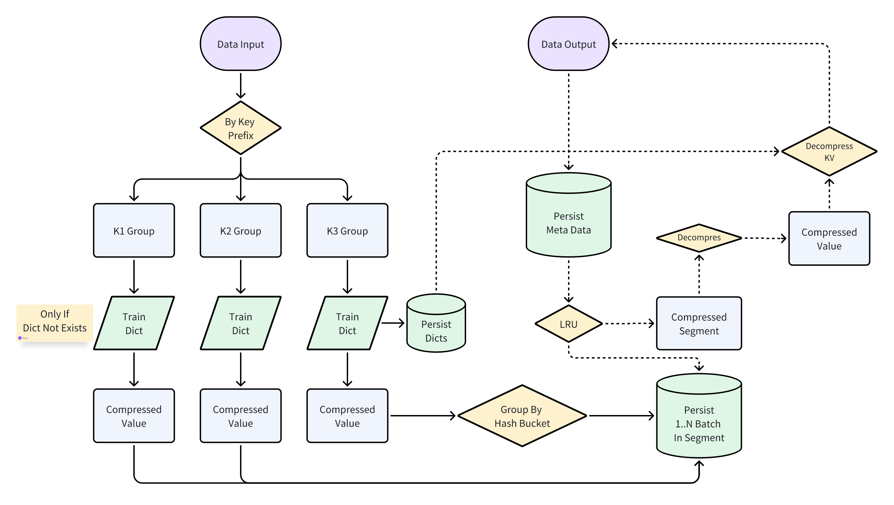
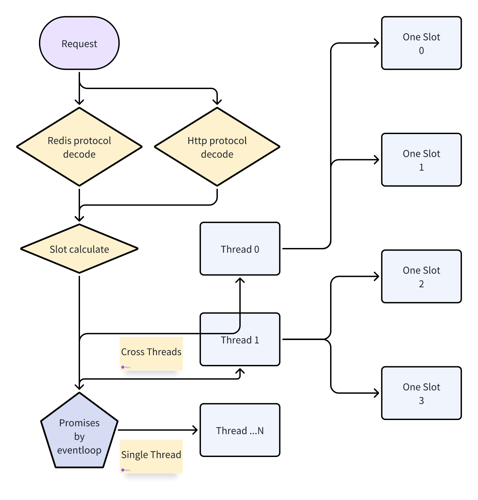
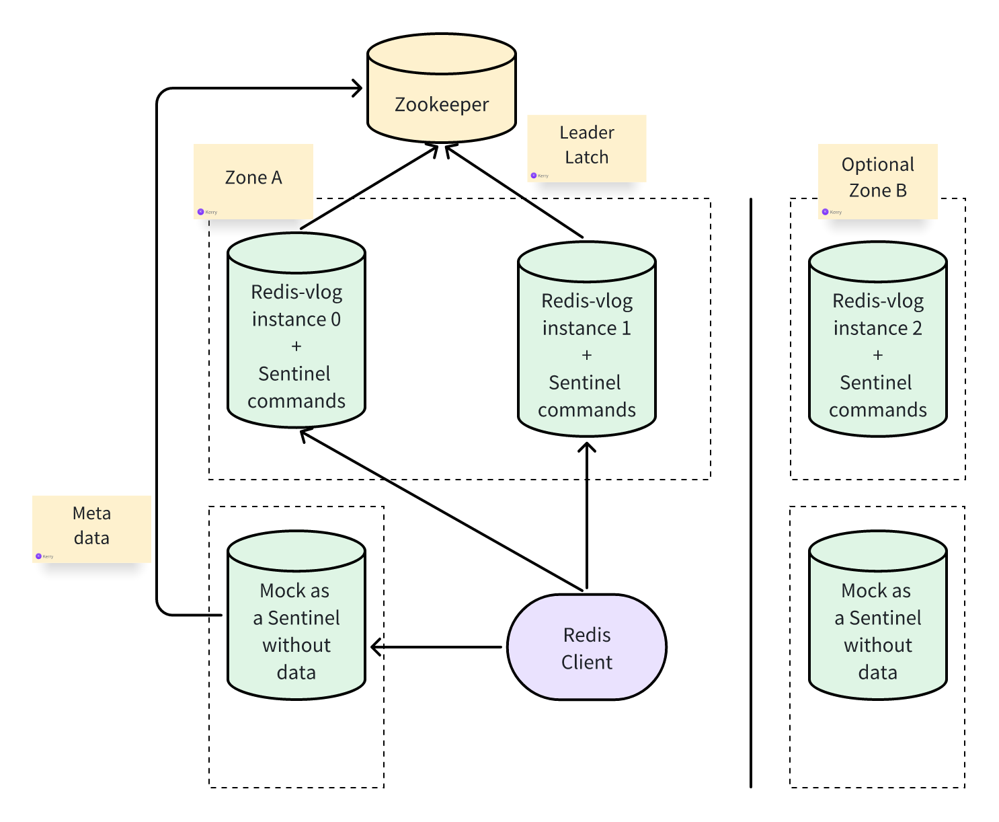

# About
A redis compatible kv store, base on slot and hash buckets.

# Features
- Redis protocol compatible
- Slot based sharding
- Hash buckets for each slot
- Key value split storage
- Just in time compaction
- Multi-threading support
- Run to complete thread safety
- Pure memory mode support
- Zstd dict based compression
- Master slave replication
- Auto failover, Redis sentinel compatible
- Prometheus' metrics support
- Http api support

# Architecture
## Dict based compression



## Run to complete thread safety



## Master slave replication and auto failover



## Hash buckets for each slot and pure memory mode
todo

# Redis command support
## string
- [√] APPEND
- [√] COPY
- [√] DECR
- [√] DECRBY
- [√] DECRBYFLOAT
- [√] DEL
- [√] EXISTS
- [√] EXPIRE
- [√] EXPIREAT
- [√] EXPIRETIME
- [√] GET
- [√] GETDEL
- [√] GETEX
- [√] GETRANGE
- [√] GETSET
- [√] INCR
- [√] INCRBY
- [√] INCRBYFLOAT
- [√] MGET
- [√] MSET
- [√] PEXPIRE
- [√] PEXPIREAT
- [√] PEXPIRETIME
- [√] PTTL
- [√] PSETEX
- [√] RENAME
- [√] SET
- [√] SETEX
- [√] SETNX
- [√] SETRANGE
- [√] STRLEN
- [√] TYPE
- [√] TTL

## hash
- [√] HDEL
- [√] HEXISTS
- [√] HGET
- [√] HGETALL
- [√] HINCRBY
- [√] HINCRBYFLOAT
- [√] HKEYS
- [√] HLEN
- [√] HMGET
- [√] HMSET
- [√] HRANDFIELD
- [√] HSET
- [√] HSETNX
- [√] HSTRLEN
- [√] HVALS

## list
- [√] LINDEX
- [√] LINSERT
- [√] LLEN
- [√] LMOVE
- [√] LPOP
- [√] LPOS
- [√] LPUSH
- [√] LPUSHX
- [√] LRANGE
- [√] LREM
- [√] LSET
- [√] LTRIM
- [√] RPOPLPUSH
- [√] RPOP
- [√] RPUSH
- [√] RPUSHX

## set
- [√] SADD
- [√] SCARD
- [√] SDIFF
- [√] SDIFFSTORE
- [√] SINTER
- [√] SINTERCARD
- [√] SINTERSTORE
- [√] SISMEMBER
- [√] SMEMBERS
- [√] SMISMEMBER
- [√] SMOVE
- [√] SPOP
- [√] SRANDMEMBER
- [√] SREM
- [√] SUNION
- [√] SUNIONSTORE

## sorted set
- [√] ZADD
- [√] ZCARD
- [√] ZCOUNT
- [√] ZDIFF
- [√] ZDIFFSTORE
- [√] ZINCRBY
- [√] ZINTER
- [√] ZINTERCARD
- [√] ZINTERSTORE
- [√] ZLEXCOUNT
- [√] ZMSCORE
- [√] ZPOPMAX
- [√] ZPOPMIN
- [√] ZRANDMEMBER
- [√] ZRANGE
- [√] ZRANGEBYLEX
- [√] ZRANGEBYSCORE
- [√] ZRANGESTORE
- [√] ZRANK
- [√] ZREM
- [√] ZREMRANGEBYLEX
- [√] ZREMRANGEBYRANK
- [√] ZREMRANGEBYSCORE
- [√] ZREVRANGE
- [√] ZREVRANGEBYLEX
- [√] ZREVRANGEBYSCORE
- [√] ZREVRANK
- [√] ZSCORE
- [√] ZUNION
- [√] ZUNIONSTORE

TIPS:
Refer to class redis.command.AGroup - redis.command.ZGroup for all supported commands.

# Quick start
## Build
### Prepare the environment:
- JDK 21
- Gradle 8.x

### Change configuration:
- edit src/main/resources/redis-vlog.properties
```properties
###
#pureMemory=false
#debugMode=true
###
#debugLogCmd=true
#debugLogMerge=true
#debugLogTrainDict=false
#debugLogRestore=false
#bulkLoad=false
### append only, slot number > 1 for cluster migration
slotNumber=1
netWorkers=1
#maxConnections=1000
###
dir=/tmp/redis-vlog
net.listenAddresses=127.0.0.1:7379
#dir=/tmp/redis-vlog2
#net.listenAddresses=127.0.0.1:7380
###
#datacenterId=1
#machineId=1
###
#localTest=false
#password=123456
### config for each one 1 slot, !important !important !important
###
estimateKeyNumber=10000000
estimateOneValueLength=200
### compression
#isValueSetUseCompression=true
#isOnDynTrainDictForCompression=true
#toCompressMinDataLength=64
#compress.dictPrefixKeyMaxLen=5
### key bucket
# when there are 100 million keys, one slot key loader max has 9 key bucket files, each file 2GB size,
# if compress ratio ~= 0.5, will cost ~= 9 * 2GB * 0.5 = 9GB
# if compress ratio ~= 0.2, will cost ~= 9 * 2GB * 0.2 = 3.6GB
# if you want cache all key buckets for better read performance, 2GB / 4KB = 512K, set max size to 512K
#bucket.lruPerFd.maxSize=524288
### chunk
# do not turn on this, use one slot kv lru better, because cache miss too much for hash algorithm, use pure memory mode if you need cache all
# when there are 100 million keys, one slot chunk has 16/32/64 chunk files, depends on one value size, each file 2GB size
# if 16 files for 200B value, 8 files expired, will cost ~= 8 * 2GB = 16GB
# segment bytes are already compressed, so need 16GB if you need cache all chunk files
# if one chunk segment length = 4KB, 2GB / 4KB = 512K, set max size to 512K
# if one chunk segment length = 16KB, 2GB / 16KB = 128K, set max size to 128K, one chunk segment length different depends on one value size
#chunk.lruPerFd.maxSize=524288
#chunk.fdPerChunk=16
### one slot
#big.string.lru.maxSize=1000
kv.lru.maxSize=1000000
###
#persist.volumeDirsBySlot=/mnt/data0:0-32,/mnt/data1:33-64,/mnt/data2:65-96,/mnt/data3:97-128
#persist.binlogOn=true
### wal
# change to 200 if memory is limit, when there are 100 million keys, one slot has 16384 wal groups,
# each group has 200 keys, if each encoded key/value ~= 200B, will cost ~= 16384 * 200 * 200B = 640MB
# short value (include remove flag value) each group has also 200 keys, if each encoded key/value ~= 100B, will cost ~= 16384 * 200 * 100B = 320MB
# if one slot kv lru max size = 10_000_000, means 10% cache hit, if each encoded key/value ~= 200B, will cost ~= 2GB
# so, need about 3GB memory for one slot
# if turn on all key bucket file read page lru cache, refer to bucket.lruPerFd.maxSize, need 4GB more
#wal.valueSizeTrigger=200
#wal.shortValueSizeTrigger=200
### repl
#zookeeperConnectString=127.0.0.1:2181
#zookeeperRootPath=/redis-vlog/cluster-test
#canBeLeader=true
#isAsSlaveOfSlave=false
```

### Build the project:
```shell
gradle jar
```

### Run the project:
```shell
cd build/libs
java -Xmx1g -Xms1g -XX:+UseZGC -XX:+ZGenerational -XX:MaxDirectMemorySize=64m -jar redis-vlog-1.0.0.jar
```

### Test the project:
```shell
redis-cli -p 7379
```

### View metrics:
- http://localhost:7379/?metrics

### Test auto failover:
- prepare zookeeper
- start one instance and change repl zookeeper connect string
- start another instance and change listen port to 7380
- wait for the second instance to become a slave, view logs
- stop the first instance, view logs
- wait for the second instance to become a master, view logs
- start the first instance, view logs
- wait for the first instance to become a slave, view logs
